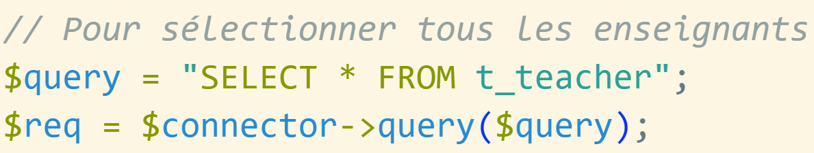
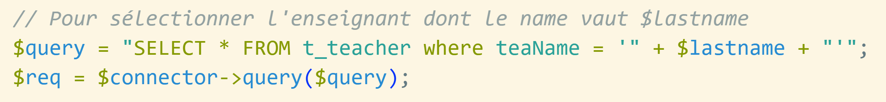
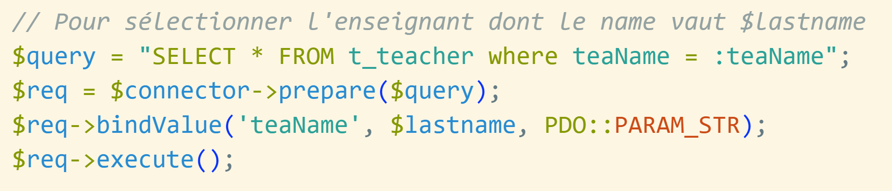
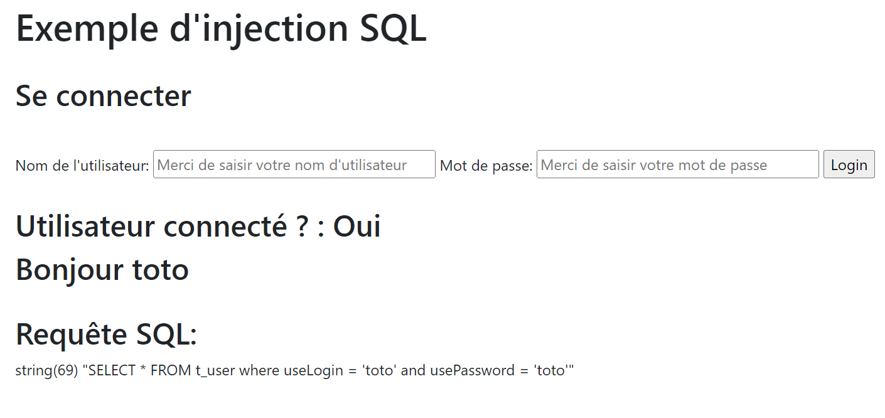
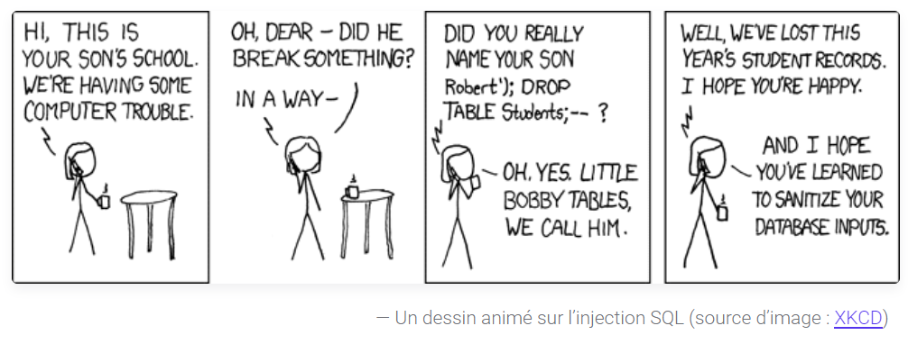

# Injection SQL

## Accroche

<!-- [{ width=55% }](https://youtu.be/YD30JdMhJu0){target="\_blank"} -->

{ width=55% }

## Objectif pédagogique

<strong>Protéger</strong> une application PHP contre les attaques par <strong>injection SQL</strong> en utilisant le connecteur PDO

## Qu'est ce qu'une attaque par injection SQL ?

## Définition

Une <strong>injection SQL</strong> est un type d’attaque qui permet à un attaquant <strong>d’insérer des instructions SQL malveillantes</strong> dans une application

## Impacts

- Exposer des données sensibles
- Compromettre l'intégrité des données
- Donner à un pirate un accès général à votre système

## Exemples d'attaques

<strong>Fortnite, 2019</strong>

Fortnite est un jeu en ligne qui compte plus de 350 millions d'utilisateurs. En 2019, une vulnérabilité par injection SQL a été détectée, susceptible de permettre aux pirates <strong>d'accéder aux comptes des utilisateurs</strong>.

## Exemples d'attaques

<strong>Cisco, 2018</strong>

Une vulnérabilité par injection SQL a été détectée dans le gestionnaire de licences Cisco Prime en 2018. La vulnérabilité permettait aux pirates <strong>d'obtenir un accès shell</strong> aux systèmes sur lesquels le gestionnaire de licences était déployé.

## Exemples d'attaques

<strong>Tesla, 2014</strong>

En 2014, des chercheurs en sécurité informatique ont annoncé qu'ils étaient en mesure de s’introduire sur le site Web de Tesla à l'aide d'une injection SQL, <strong>obtenant des privilèges d'administration</strong> et volant les données des utilisateurs.

## Connecteur PDO

propose 2 méthodes pour exécuter une requête SQL :

- méthode <strong>query()</strong>
- méthode <strong>prepare()</strong>

## Méthode query() - Exemple 1

{ width=65% }

Question : Code sécurisé ?

## Méthode query() - Exemple 1

{ width=65% }

<span style="color:green; padding-bottom: 50px;">  Code sécurisé !</span>

## Méthode query() - Exemple 2

{ width=100% }

Question : Code sécurisé ?

## Méthode query() - Exemple 2

{ width=100% }

<span style="color:red; padding-bottom: 50px;">  Code non sécurisé !</span>

## Règle

Nous devons utiliser la méthode <strong>prepare()</strong> dès que la requête SQL est créée à partir d'une concaténation des valeurs saisies par l'utilisateur

## Correction de l'exemple 2 - prepare()

{ width=100% }

## Correction de l'exemple 2 - prepare()

{ width=100% }

<span style="color:green; padding-bottom: 50px;">  Code sécurisé !</span>

## Challenge pour les Hackers

{ width=100% }

## Challenge pour les Hackers

[E-151-GCR-InjectionSQL.pdf](https://eduvaud.sharepoint.com/:b:/s/ETML_INF-GRP2A-22-23_Teams/EVrCNCE5TVxInjw_DpRCYGgBpzYaj5oA0-O8mvxLhmBfuQ?e=Z9bxQU){target="\_blank"}

## Evaluation

[Formulaire FORMS](https://forms.office.com/r/if6pEDReH7){target="\_blank"}

## Merci pour votre attention !

{ width=100% }

<!-- Use
  pandoc -t revealjs -V theme=simple -s -o myslides.html presentation-git.md && chromium "file://$(pwd)/myslides.html?print-pdf"

  pandoc -t revealjs -V theme=simple -V progress=true -V slideNumber=true -V spotlight=true --slide-level=2 -s -o myslides.html presentation-git.md && chromium "file://$(pwd)/myslides.html"

-->
<style>
  .reveal h1 { font-size: 2em; }
  .reveal h2 { font-size: 1.6em; }
  .reveal h3 { font-size: 1.4em; }
  .reveal h4 { font-size: 1.2em; }
  .reveal h5 { font-size: 1.1em; }
  .border { border: 1px solid #555; }
  .reveal blockquote { width: 100% }
  .reveal blockquote:before {
    display: block;
    padding-left: 10px;
    content: "\201C";
    font-size: 80px;
    position: absolute;
    left: -20px;
    top: -20px;
    color: #7a7a7a;
  }
  .reveal cite:before { content: "\2009 \2015 \2009"; }
  .reveal cite { font-size: 80%; }
  .reveal code {
    background-color: #eee;
    border-radius: 3px;
    font-family: courier, monospace;
    padding: 0 3px;
    font-size: 0.8em;
  }
</style>

```

```
